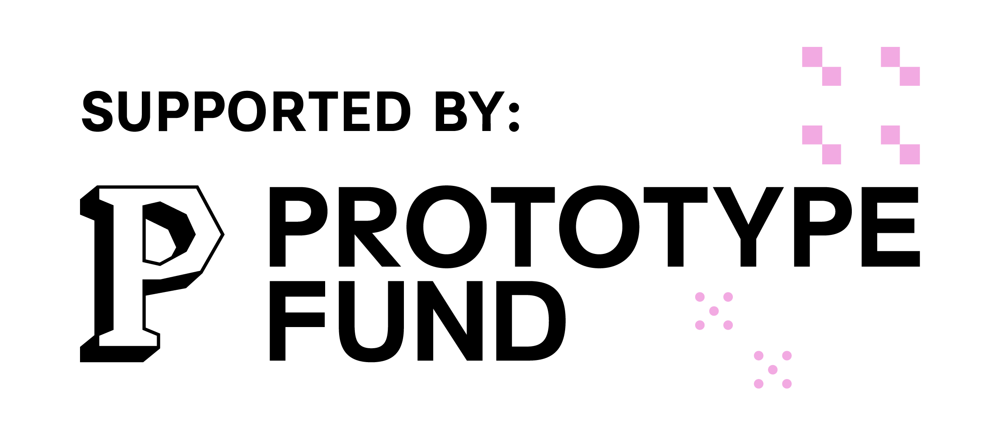

# OpenAleph Explore for Obsidian

This Obsidian plug-in allows a user to send a note to all the OpenAleph instances they have access to, simultaneously, in order to extract structured Follow the Money data and related terms. The plug-in displays this data and graph form, tracing connections between the note, Follow the Money data, and closely related terms. All entities are also listed in a table. The Follow the Money data can be imported back into the user's Obsidian vault.

A video tutorial is in the works, to help guide users through how this plug-in can be used.

OpenAleph 5.3 introduced a new [Screening](https://openaleph.org/blog/2026/how-to-use-the-new-screening-feature/) feature, that allows a user to search through an instance using a document instead of a search query. In other words, instead of searching for a name and some attributes, a journalist can now use their own notes or the text from an investigative article to find all the structured data that an OpenAleph instance has, that is directly related to the contents of the document. Think of this as _reverse search_.

The OpenAlephExplore plug-in allows a user to perform reverse search across all the OpenAleph instances that they have access to. The API key belonging to each instance is stored using the [SecretStorage](https://docs.obsidian.md/plugins/guides/secret-storage) Obsidian feature.

OpenAlephExplore fetches all the [Follow the Money](https://followthemoney.tech/) data related to the note used for reverse search. Them, for each FtM entity, the plug-in also fetches up to 5 [closely correlated terms](https://openaleph.org/blog/2025/when-names-travel-together-discover-correlations-in-your-data/#the-discovery-dashboard).

All data is displayed in a connected graph and in a table. For each note, a direct link to the table, the graph, and the raw data are added to the [Markdown frontmatter](https://frontmatter.codes/docs/markdown) of the note. This data is saved in a separate directory, called `openaleph`.

**The graph can surface surprising connections.** Different Follow the Money entities, from different OpenAleph instances, may have the same closely related term, which can unearth leads that would not have been visible from searching through only one instance.

The plug-in allows investigator to save Follow the Money entities to their Obsidian vault. The properties are rendered as [Markdown frontmatter](https://frontmatter.codes/docs/markdown) at the top of the note. This note is saved in a separate directory, with a configurable name (by default, `followthemarkdown`).

These Markdown files, containing Follow the Money entities, we have affectionately called "Follow the Markdown". They are meant to be treated as a source of information, not edited. They can be referenced in other notes, by using their title, in the WikiLinks notation: `[[Name of Enitty]]`.

⚠️ This plug-in is in an Alpha stage. It _may_ still contain bugs. If you would like to report a bug or request a feature, please [open an Issue](https://codeberg.org/Noop/OpenAlephSearch/issues).

## Why, though?

The [OpenAleph](https://openaleph.org/) free and open-source software is a staple of journalistic investigations. It is a platform that allows users to upload large volumes of data and make sense of what is inside. OpenAleph can reveal names, addresses, and other interesting artefacts. It makes all uploaded data searchable, and can translate betwen languages. The more [advanced](https://openaleph.org/blog/2025/openaleph-51-released-reworked-synonym-search-and-new-tagging-feature/#improved-search-for-names-and-their-synonyms) search features allow users to ["hydrate"](https://openaleph.org/blog/2025/when-names-travel-together-discover-correlations-in-your-data/#closely-correlated-names) their search terms with additional context, or to perform [reverse search](https://openaleph.org/blog/2026/how-to-use-the-new-screening-feature/).

DARC, the company that maintains OpenAleph, has [a public instance](https://search.openaleph.org/) with open-source data that can be searched by anything. No account required. There are many other instances like this, belonging to researchers and journalists.

This plug-in makes heavy use of two technical implementations in modern OpenAleph instances, running on version 5.3 or greater: the [reverse search](https://openaleph.org/blog/2026/how-to-use-the-new-screening-feature/) (the **Screening** feature) and [closely correlated terms](https://openaleph.org/blog/2025/when-names-travel-together-discover-correlations-in-your-data/#the-discovery-dashboard) (the **Discovery** feature). These two make direct use of ElasticSearch features: [percolation](https://www.elastic.co/docs/reference/query-languages/query-dsl/query-dsl-percolate-query) and [significant terms](https://www.elastic.co/docs/reference/aggregations/search-aggregations-bucket-significantterms-aggregation) respectively.

By using notes written in natural language in order to gather structured Follow the Money data and correlated terms, the OpenAlephExplore plug-in allows investigators to use their existing knowledge base as search queries. Even quickly jotted down thoughts, questions and hypotheses can serve an investigator as a vehicle for searching across all OpenAleph instances they have access to, simultaneously.

## Installation

You must have [Obsidian](https://obsidian.md/) installed in order to use this plug-in.

Your Obsidian app version must be equal or newer `1.13.0`. You can see the version by opening the **Settings** and navigating to the **General** section. If you have an older version of Obsidian, [upgrade to a more recent version](https://obsidian.md/help/updates).

This plug-in can be installed directly via the Obsidian Community plug-ins catalogue. Two other installation methods are detailed below.

### Install using the BRAT plug-in

If you already have the Beta Reviewers Auto-update Tester plug-in (called BRAT), you can add `https://github.com/noop-ptf/OpenAlephExplore.git` and select the latest version of this plug-in.

### Install from source code

1. Make sure you have NodeJS installed, and that the version is at least v18 (`node --version`). If you don't have NodeJS installed, follow [the official instructions](https://nodejs.org/en/download)
2. Navigate to the plug-ins directory of your Obsidian vault (usually located at `VaultName/.obsidian/plugins/your-plugin-id/`). Here, run `git clone https://github.com/noop-ptf/OpenAlephExplore.git`.
3. Navigate into the newly-created directory, that contains the source code, and install the dependencies: `npm i`
4. Run `npm run build`. This should produce three files: `main.js`, `styles.css`, `manifest.json`.
5. Open Obsidian, navigate to the **Settings** > **Community plugins** and refresh the list of plug-ins. OpenAleph Search should appear. Enable it.

## Related projects

[OpenAleph Search](https://github.com/noop-ptf/OpenAlephSearch) allows a user to search through many different OpenAleph instances simultaneously.

## Sponsor

OpenAleph Explore: an Obsidian Plug-in is funded by the German **Federal Ministry of Research, Technology and Space (BMFTR)** through the **[Prototype Fund](https://prototypefund.de)** under funding code (Förderkennzeichen) **16IS26S15**.

